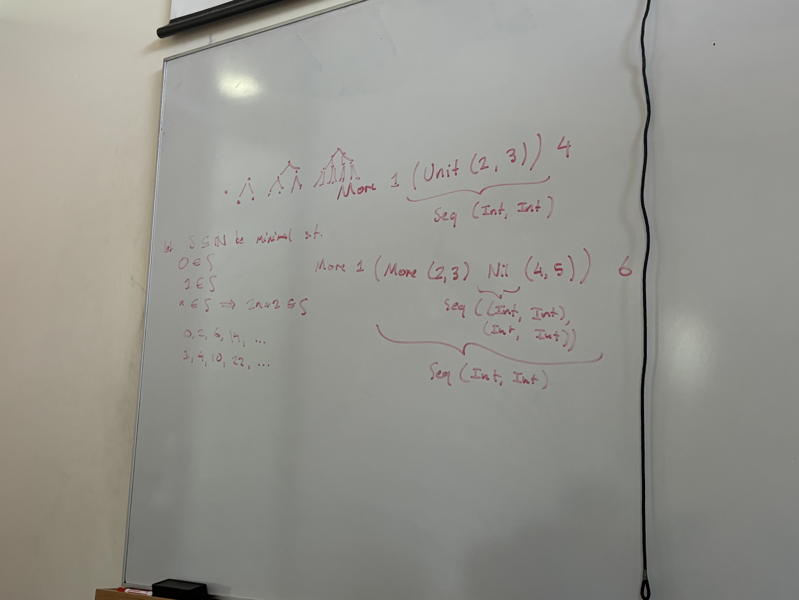

# *Finger Trees Explained Anew, and Slightly Simplified* (Claessen '20)

During the discussion of how Try 3 goes wrong.

Top left: examples of complete binary trees.

Bottom left: inductive definition of the set of representable lengths of sequences in Try 3.

Right side: examples of sequences (to illustrate the non-regular recursion).
